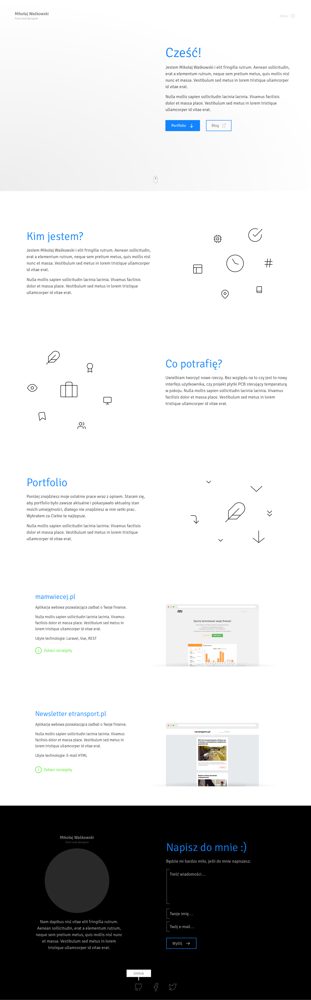

# Portfolio
> This is the place where You can see what I can do for You :)

Link to the live version: [mwaskowski.pl/portfolio](#)



## Goals
- [ ] Design: Simple and clean, pure animation
- [ ] HTML: HTML5
- [ ] CSS: BEM, ~~frameworks~~
- [ ] JS: ES6 witch babel conversion
- [ ] SEO: Schema.org

## Commands

List of commands:

```sh
npm install
gulp serve
```

## Built with

* [Google Web Starter Kit](https://github.com/google/web-starter-kit)


## Release history
* 0.2
    * -First change-
* 0.1
    * Work in progress


---

Mikolaj Waskowski &copy; 2017

Blog (Polish): [mwaskowski.pl](http://mwaskowski.pl/)  
Facebook: [@waskowski.mikolaj](https://www.facebook.com/waskowski.mikolaj)  
Twitter: [@waskowskim](https://twitter.com/waskowskim)  