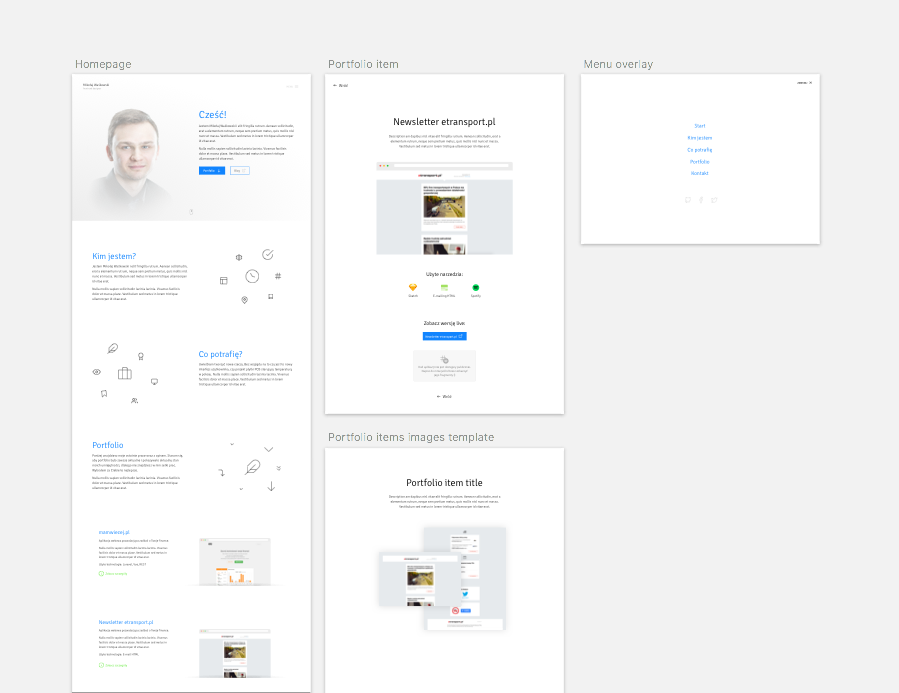

# Portfolio
> I'm a Front-end developer and UI designer combination. Feel free to send me a feedback about this project :)

Live version: [mikolajwaskowski.github.io/portfolio](https://mikolajwaskowski.github.io/portfolio/)



## Goals
- [x] Design: Simple and clean, pure animation
- [x] HTML: HTML5
- [x] CSS: BEM, ~~frameworks~~
- [ ] JS: ES6 witch babel conversion
- [ ] SEO: Schema.org

## Commands

List of commands:

```sh
npm install // install required dependencies
gulp serve // server on localhost witch live-reload
gulp // build /disc folder

git subtree push --prefix dist origin gh-pages // push subtree /dist into gh-pages branch
```

## Built with

* [Google Web Starter Kit](https://github.com/google/web-starter-kit)


## Release history
* 0.1
    * Work in progress


---

Mikolaj Waskowski &copy; 2017

Blog (Polish): [mwaskowski.pl](http://mwaskowski.pl/)  
Facebook: [@waskowski.mikolaj](https://www.facebook.com/waskowski.mikolaj)  
Twitter: [@waskowskim](https://twitter.com/waskowskim)  